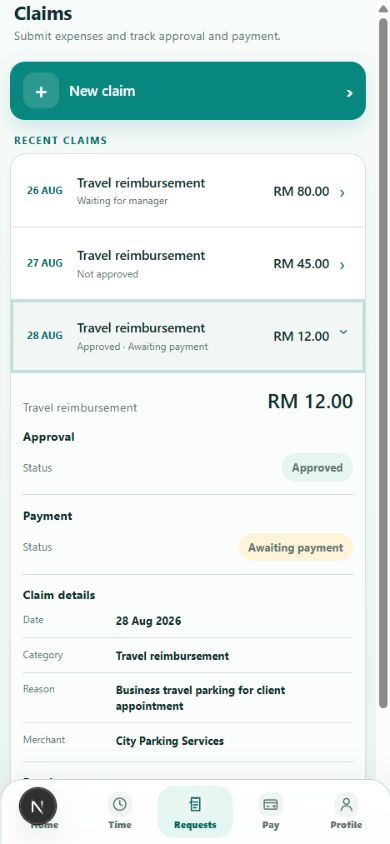
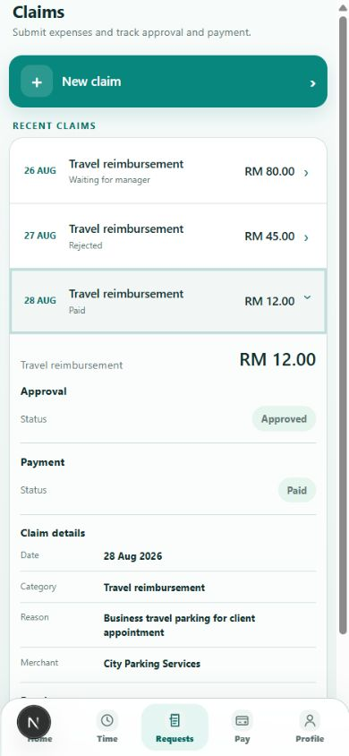
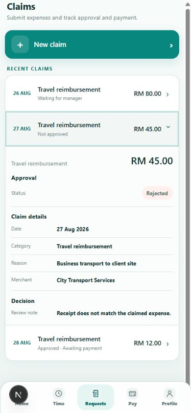
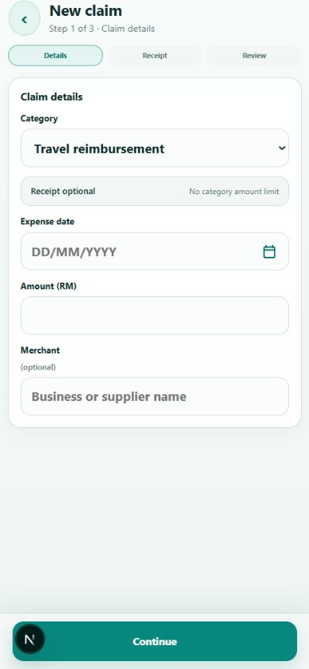
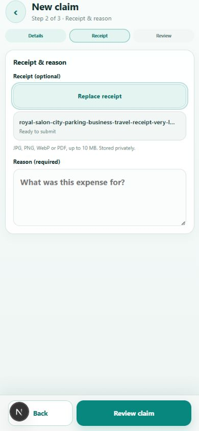
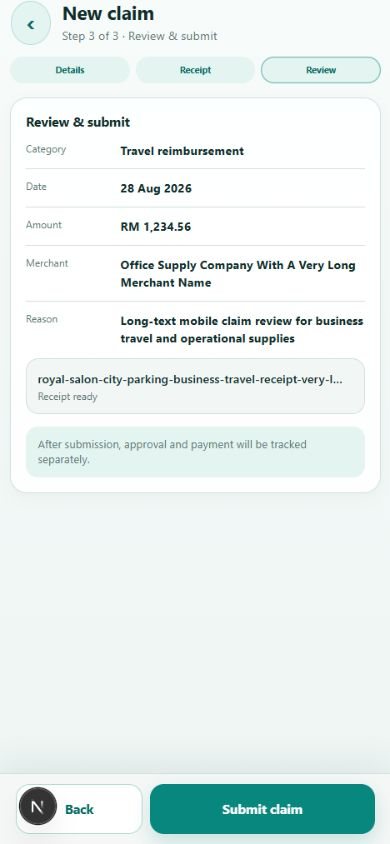
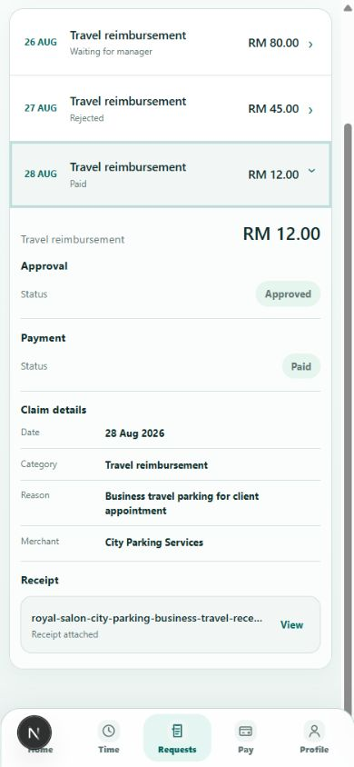
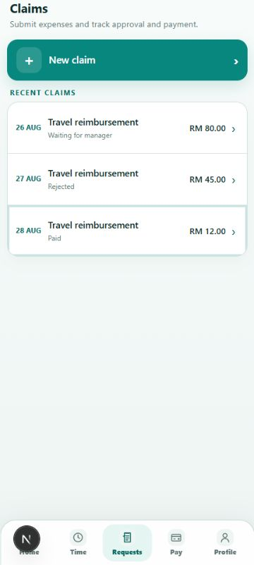
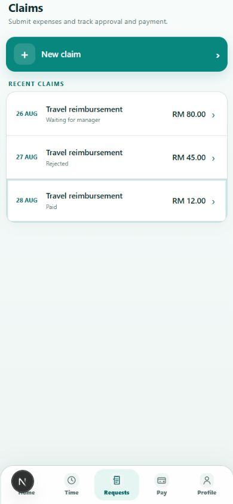
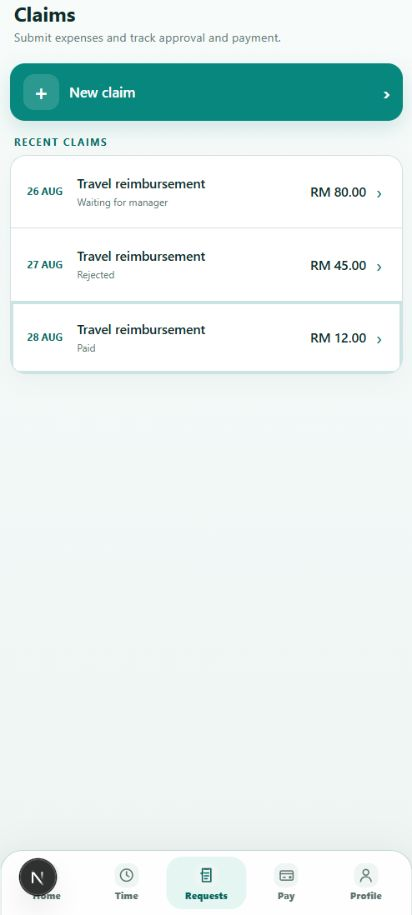

# TETAMU STAFF 3000 — CLAIMS V2 IMPLEMENTATION REPORT

## 1. FINAL VERDICT

**READY FOR OWNER PHYSICAL-DEVICE REVIEW.** Claims V2 已在 Staff 3000 canonical runtime 完成，并由 clean controlled source 部署至 Railway **Testing**。本轮仅改变 Claims 呈现层与员工端状态文案；既有 claim submission、审批、reimbursement、payroll、租户隔离及权限路径均保留。

- Implementation commit: `7bf00180846b2a42824da0aee4799849e682f954`
- Branch: `codex/staff-claims-v2`
- Controlled worktree: `C:\CodexTetamuP0-leave-v2`
- Canonical route: `/staff/claims`
- Staff runtime: **3000 only**
- Environment: **LOCAL / RAILWAY TESTING ONLY**

## 2. PAGE STRUCTURE

Claims landing 采用单一、清楚的顺序：Page Header → New claim → Recent claims。移除了旧版大面积绿色 hero、长驻展开表单和重叠卡片。页面最大宽度受控，并沿用 Staff V2 canvas、spacing、row、badge 与 safe-area 规则。

## 3. NEW CLAIM ENTRY

Landing 只保留一个高辨识度、58px 高的 `New claim` task entry。它进入同一路由内的受控 task mode，不新增 Claims route，也不改变 Requests Hub 的入口。任务期间隐藏全局 bottom navigation，离开任务后恢复。

## 4. RECENT CLAIMS

默认展示最近 3 项 claim row，金额为主信息，日期/类别/merchant 为辅助信息，并仅显示一个 canonical combined status。用户可用 `Show more recent claims` 展开本次 read model 已取得的记录。

后端现有 overview query 上限为 `take: 100`，因此 UI 明确使用 **Recent claims**，没有误称 **All claims history**。

## 5. CLAIM STATUS SYSTEM

员工端 status presentation 集中在 `src/lib/claim/presentation.ts`，目前映射为：

| Canonical state | Employee-facing status |
|---|---|
| Submitted | Waiting for manager |
| Rejected | Rejected |
| Approved, reimbursement channel pending | Approved · Awaiting payment |
| Approved, outside-payroll processing | Approved · Payment processing |
| Approved, payroll-linked | Approved · Added to payroll |
| Outside-payroll paid | Paid |
| Settled through finalized payroll | Included in finalized payroll |

## 6. APPROVAL VS PAYMENT

Claim detail 明确分成独立的 **Approval** 与 **Payment** sections。Approval 表示经理决定；Payment 表示 reimbursement/settlement 进度。UI 不再把 Approved 当成 Paid，也不会以单一模糊 badge 掩盖两个生命周期。

## 7. APPROVED + AWAITING PAYMENT

Approved claim 若尚未选择或完成 reimbursement，会显示：

- Approval: `Approved`
- Payment: `Awaiting payment`

真实本地 canonical flow 已从 manager review 后捕获此状态：

## 8. PAYMENT PROCESSING

已批准且 outside-payroll reimbursement 尚未完成时显示 `Payment processing`。该映射由集中 presentation helper 与单元测试覆盖；没有新增前端独立 payment state。

## 9. PAYROLL-LINKED CLAIM

已批准且绑定 payroll reimbursement 时显示 `Added to payroll`；只有 payroll run finalized 后才显示 `Included in finalized payroll`。没有虚构付款日期或绕过 canonical payroll linkage。

## 10. PAID CLAIM

Outside-payroll reimbursement canonical `paidAt` 存在时才显示 `Paid`。真实本地 flow 已经通过既有 `selectClaimReimbursementChannel` 与 `markClaimReimbursementPaidOutsidePayroll` 验证：

## 11. REJECTED CLAIM

Rejected detail 显示 Approval = `Rejected` 及 canonical decision reason。若不存在 canonical reimbursement，则不渲染无意义的 Payment section：

## 12. CLAIM DETAIL

Detail 使用 compact sections：Approval、Payment（适用时）、Claim details、Receipt、Decision（适用时）。保留安全的 inline `
` disclosure，避免额外 route 与大面积展开。没有显示 `Next action / No action needed` 等无帮助文案。

## 13. 3-STEP FLOW

New Claim 是明确的 3-step task flow：Details → Receipt → Review。task state 只在当前 React session 内；提交仍调用原 canonical API。离开任务不会产生半完成 canonical claim。

## 14. STEP 1

Step 1 只收集 canonical claim facts：Category、Expense date、Amount 或 Mileage distance、Merchant。金额使用 `type="number"`、`step="0.01"` 与 decimal input mode。

## 15. STEP 2

Step 2 收集 Receipt 与 expense reason。file picker 保留 canonical MIME/10MB validation，并用 `StaffV2AttachmentRow` 显示已选文件，可替换 receipt。

## 16. STEP 3

Step 3 为 read-only review，不重复编辑 controls。Back 为 secondary action，Submit claim 为唯一 primary action；说明清楚告知 submission 后 approval 与 payment 会分别追踪。

## 17. RECEIPT / ATTACHMENT UX

Receipt row 显示实际文件名、类型与可访问的 view label。长文件名使用视觉 ellipsis，但通过 `title` 与完整 `aria-label` 保留完整名称。没有加入 OCR、camera capture、公开 storage 或未经授权的 attachment workflow。

## 18. AMOUNT / CURRENCY

金额统一经 `formatEmployeeClaimAmount` 输出，例如 `RM 1,234.56`。presentation 不自行改写 canonical submitted total，也没有新增 currency conversion。

## 19. TASK CTA / SAFE AREA

Review footer 使用共享 `StaffV2StickyActionBar`，固定区域考虑左右与底部 safe-area。task content 预留 `92px + safe bottom`，global nav 在 task mode 隐藏，因此 Submit 不会与 bottom navigation 重叠。Paid detail 的最后内容也可完整滚至 nav 之上：

## 20. EMPTY

无记录时使用共享 Empty State：`No claims yet.`，并提供清楚的 `New claim` 动作；不渲染空白大卡或误导性的历史摘要。

## 21. LOADING

Loading 使用稳定 row skeleton，不改变页面宽度，不展示 stale employee data，也不出现大面积闪烁 hero。

## 22. ERROR

读取失败显示员工可理解的 `Claims couldn't load.`、`Try again` 与 `role="alert"`；不会泄漏 Prisma、数据库或 stack trace。提交错误继续由 canonical API 错误映射处理。

## 23. MOBILE 360

360px 真实浏览器 viewport 验证通过：无横向 overflow，金额、status、长文本可收缩，44px touch target 保留。

## 24. MOBILE 390

390px 验证通过：landing、detail、receipt、review footer 与 bottom-nav clearance 均正常，`scrollWidth === innerWidth`。

## 25. MOBILE 412

412px 验证通过：row hierarchy 清楚、没有不必要双栏、没有 horizontal overflow，最后一项可完全滚至 fixed navigation 之上。

## 26. ACCESSIBILITY

- Interactive controls 保持至少 44px target。
- Focus-visible styles 明确。
- Status 不只依赖颜色，并有文字标签。
- Receipt link 有文件名级 aria label。
- Error 使用 alert semantics。
- Reduced-motion preference 受支持。
- 长 merchant、reason、filename 使用安全换行或 ellipsis。

## 27. REQUESTS HUB REGRESSION

Requests Hub `/staff/requests` 与永久 Claims entry 未改变。Claims route 与 Requests IA 保持一致，Requests Hub/Claims V2 focused regression 通过。

## 28. LEAVE REGRESSION

Leave 页面、submission、balance 与 approval workflow 未修改。Leave V2 focused regression 通过。

## 29. APPROVAL CENTER REGRESSION

Manager Approval Center、claim review engine、self-review protection 与 unified counts 均未修改。Approval Center、unified approvals 与 claim security 回归通过。

## 30. HOME / TIME REGRESSION

Home、Time Hub、Schedule、Attendance History 与 Staff shell navigation 未重新设计。Home/Time/Staff PWA regression 通过。

## 31. TIMESHEET / PAYROLL REGRESSION

Timesheet、OT、payroll run、claim payroll integration 及 reimbursement engine 未修改。Timesheet、attendance-payroll 与 payroll-claim focused regression 通过。

## 32. FILES CHANGED

- `src/components/staff-pwa/staff-claims.tsx`
- `src/components/staff-pwa/staff-claims.module.css`
- `src/lib/claim/presentation.ts`
- `tests/unit/claims-presentation.test.ts`
- `tests/unit/staff-claims-v2.test.ts`（new）
- `artifacts/claims-v2/*.png`（10 张 local UAT evidence）

没有修改 API route、service engine、database schema 或 migration。

## 33. TEST RESULTS

- TypeScript `npx tsc --noEmit`: **PASS**
- Focused Claims: **18/18 PASS**
- Focused cross-feature regression: **162/162 PASS**
- Targeted ESLint: **PASS**
- Full ESLint: **PASS，0 errors**（3 个既有 warnings，与本轮无关）
- Production build: **PASS**
- `git diff --check`: **PASS**

第一次 build 因仍运行的 local Next dev server 锁住 Prisma Windows query engine 而出现 `EPERM`；停止 dev server 后相同 source 重跑 build 成功。这是本机 runtime lock，不是产品回归。

## 34. FULL UNIT STATUS

`npm test`: **1332/1332 PASS, 0 failed**。

## 35. READ MODEL / DRAFT PERSISTENCE ENRICHMENT STATUS

- **READ MODEL ENRICHMENT REQUIRED**：现有 overview query 限制 `take: 100`，足以支持 Recent claims，但若产品要提供完整 archive/pagination，需要 canonical cursor/page read model；本轮没有用前端假分页冒充完整历史。
- **DRAFT PERSISTENCE ENRICHMENT REQUIRED**：3-step draft 目前为 React in-memory task state。若未来要求跨 refresh/device 保存草稿，应建立受控 canonical draft capability；本轮没有使用 localStorage 或新 schema 绕过该需求。

## 36. CSS DEBT STATUS

Claims 原单行 legacy CSS 已替换为 scoped CSS module，并复用 Staff V2 semantic tokens/primitives；没有新增第三层全局 giant override。后续若多个 task page 采用相同 step indicator，可再提升为共享 primitive，但当前不构成阻塞。

## 37. NO BACKEND CHANGE

**CONFIRMED.** Claim submission API、attachment validation、approval、reimbursement、payroll integration、tenant/membership scoping、RBAC 与 session 均未修改。Local UAT fixture 只通过既有真实 UI/canonical services 创建和推进；Railway Testing fixture data 未被预先修改。

## 38. NO NEW MIGRATION

**NO NEW MIGRATION.** Schema 与 migrations 均未改变。

## 39. TESTING DEPLOYMENT

- Deployment ID: `e8dc46c0-2dfe-457d-b62d-28d187e678e6`
- Implementation commit: `7bf00180846b2a42824da0aee4799849e682f954`
- Status: **SUCCESS**
- Service: `tetamu-staff-app`
- Environment: `testing`
- URL: `https://tetamu-staff-app-testing.up.railway.app`
- Region: Southeast Asia

Post-deploy smoke：

| Route | HTTP | Result |
|---|---:|---|
| `/api/health` | 200 | PASS |
| `/staff/login` | 200 | PASS |
| `/staff/requests` | 200 | PASS |
| `/staff/claims` | 200 | PASS |
| `/staff/approvals` | 200 | PASS |
| `/staff/leave` | 200 | PASS |
| `/staff/timesheet` | 200 | PASS |

**TESTING ONLY**

## 40. PRODUCTION STATUS

**PRODUCTION NOT ACCESSED**  
**PRODUCTION NOT MODIFIED**

