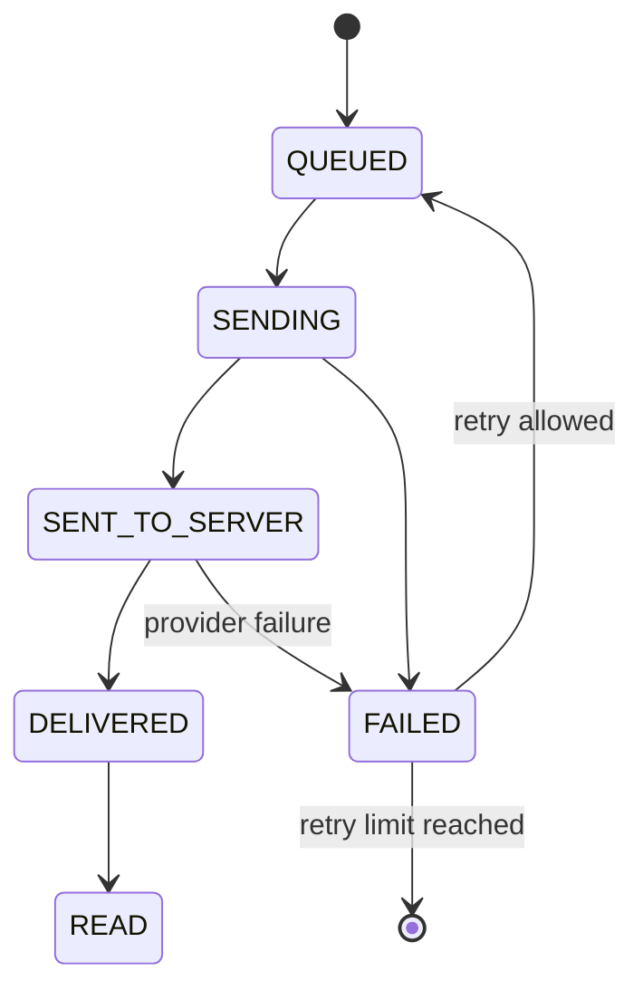

# Closing Snapshot Phase 3: WhatsApp Daily Closing Automation

Status: local product and technical design only. No migration, no deployment, no real WhatsApp sending.

## 1. Current Architecture

### Closing Snapshot

- `DailyClosingSnapshot` stores one frozen closing report per `businessId + branchId + businessDate`.
- The snapshot already contains:
  - `reportDataJson`: frozen report payload.
  - `whatsappText`: frozen WhatsApp-ready daily report text.
  - `timezone`, `businessType`, expected cash, actual cash, cash difference and closing note.
- The close action builds the report at close time, then saves the frozen version. This matches the rule that official WhatsApp reports must not use live-changing data.

### WhatsApp Queue

- `NotificationQueue` is the existing async send queue.
- It supports:
  - `QUEUED`, `SENDING`, `SENT_TO_SERVER`, `DELIVERED`, `READ`, `FAILED`, `CANCELLED`.
  - `dedupeKey` unique protection.
  - retry count and `nextAttemptAt`.
  - optional link to `WhatsAppMessage`.
- `WhatsAppMessage` is the message log visible to the system.
- The worker drains queued messages and sends through the Connector. It does not currently schedule closing reports or unclosed reminders.

## 2. Recommended Business Flow

### Closing completed

1. Staff closes a branch day.
2. System creates a frozen `DailyClosingSnapshot`.
3. System creates one send job per enabled recipient.
4. Message body is copied from `DailyClosingSnapshot.whatsappText`.
5. Queue sends asynchronously.
6. Delivery status updates the queue and message log.

### Deadline reached but not closed

1. Scheduler checks each branch after its deadline in business timezone.
2. If no snapshot exists for that `businessDate`, enqueue an unclosed reminder.
3. Reminder text must only say the branch has not closed yet. It must not include live sales totals.
4. Re-running scheduler must not duplicate the reminder.

### Manual send and resend

- `Send now` is allowed only from a frozen snapshot.
- `Resend` creates a new queue job only when permission allows it and dedupe policy permits that resend event.
- Manual sends must write an audit trail.

## 3. Data Model Draft

No migration is executed in this phase.

```prisma
model BranchClosingWhatsAppSetting {
  id                    String   @id @default(uuid())
  businessId            String
  branchId              String
  enabled               Boolean  @default(false)
  deadlineLocalTime      String   @default("22:30")
  timezone              String   @default("Asia/Kuching")
  sendClosedReport       Boolean  @default(true)
  sendUnclosedReminder   Boolean  @default(true)
  createdAt             DateTime @default(now())
  updatedAt             DateTime @updatedAt

  business Business @relation(fields: [businessId], references: [id], onDelete: Cascade)
  branch   Branch   @relation(fields: [branchId], references: [id], onDelete: Cascade)
  recipients BranchClosingWhatsAppRecipient[]

  @@unique([businessId, branchId])
  @@index([businessId])
}

model BranchClosingWhatsAppRecipient {
  id          String   @id @default(uuid())
  businessId  String
  branchId    String
  settingId   String
  label       String
  phone       String
  isActive    Boolean  @default(true)
  sortOrder   Int      @default(0)
  createdAt   DateTime @default(now())
  updatedAt   DateTime @updatedAt

  setting BranchClosingWhatsAppSetting @relation(fields: [settingId], references: [id], onDelete: Cascade)

  @@index([businessId, branchId])
}
```

Recommended additions to existing queue/message tables:

```prisma
enum WhatsAppMessageType {
  DAILY_CLOSING_REPORT
  DAILY_CLOSING_UNCLOSED_REMINDER
}

model NotificationQueue {
  dailyClosingSnapshotId String?
}

model WhatsAppMessage {
  dailyClosingSnapshotId String?
}
```

Alternative: keep `messageType` string in queue, but add `dailyClosingSnapshotId` to link reports to closing history.

## 4. Owner Recipient Scope

Recommendation: branch-level settings with business-level defaults.

- Business default: company owner or finance manager recipients.
- Branch override: branch manager or outlet owner recipients.
- Multiple recipients should be supported because many businesses have owner + manager + accountant.
- Each recipient stores a normalized phone and display label.

## 5. Timezone and Business Date

- Deadline is stored as local branch time, for example `22:30`.
- Scheduler converts local deadline using the branch/business timezone.
- Business date should use the same helper as Closing Snapshot.
- Cross-midnight businesses need a future `businessDayStartTime` setting. Until then, use the existing business date helper consistently.

## 6. Queue, Scheduler and API Design

### Server actions

- `updateClosingWhatsAppSettingsAction`
- `previewClosingWhatsAppMessageAction`
- `sendClosingSnapshotWhatsAppAction`
- `resendClosingWhatsAppAction`

### Scheduler job

- Runs every 5 to 15 minutes.
- For each enabled branch:
  - compute target business date.
  - if snapshot exists and closed report not queued/sent, enqueue report.
  - if deadline passed and snapshot does not exist, enqueue unclosed reminder.

### Queue worker

- Reuse existing `NotificationQueue`.
- Do not send directly from the closing request.
- Connector unavailable means queue remains retryable and UI shows pending or failed state.

## 7. Idempotency

Recommended dedupe keys:

```text
closing-report:{snapshotId}:{recipientId}
closing-report-manual:{snapshotId}:{recipientId}:{manualAttemptId}
closing-unclosed:{businessId}:{branchId}:{businessDate}:{recipientId}
```

Rules:

- Auto report can be queued once per snapshot recipient.
- Auto unclosed reminder can be queued once per branch/date/recipient.
- Manual resend must create a visible new attempt but still prevent double-click duplicates using a short-lived manual attempt id.

## 8. Failure Retry and Status Machine



Recommended behavior:

- Retry connector/network failure.
- Stop retry for invalid phone after validation failure.
- Display the last error in send history.
- Keep all attempts for audit.

## 9. Permissions and Isolation

- Only users with `CLOSING` permission can preview closing reports.
- Only owner/admin or a new `WHATSAPP_SETTINGS` permission can edit recipients/settings.
- Manual send/resend requires `CLOSING` plus `WHATSAPP_SEND` or owner/admin.
- Every query must filter by `businessId` and allowed `branchId`.
- URL `branchId` cannot bypass staff branch scope.
- Queue jobs must include `businessId`, `branchId`, and optional `dailyClosingSnapshotId`.

## 10. Templates

### Official daily closing report

English:

```text
Daily Closing Report
Branch: {{branchName}}
Date: {{businessDate}}
Status: Closed

Sales: RM{{sales}}
Collected: RM{{collected}}
Outstanding: RM{{outstanding}}
Expected Cash: RM{{expectedCash}}
Actual Cash: RM{{actualCash}}
Cash Difference: RM{{cashDifference}}

Closed by: {{closedBy}}
Closed at: {{closedAt}}
Note: {{closingNote}}
```

中文:

```text
每日营业总结
分店：{{branchName}}
日期：{{businessDate}}
状态：已关账

营业额：RM{{sales}}
已收款：RM{{collected}}
未收款：RM{{outstanding}}
系统现金：RM{{expectedCash}}
实际现金：RM{{actualCash}}
现金差额：RM{{cashDifference}}

关账人员：{{closedBy}}
关账时间：{{closedAt}}
备注：{{closingNote}}
```

### Unclosed reminder

English:

```text
Closing Reminder
Branch: {{branchName}}
Date: {{businessDate}}

This branch has not completed daily closing after {{deadline}}.
Please close the day in Tetamu POS.
```

中文:

```text
关账提醒
分店：{{branchName}}
日期：{{businessDate}}

此分店在 {{deadline}} 后仍未完成每日关账。
请到 Tetamu POS 完成关账。
```

## 11. UI Plan

### WhatsApp Settings: Automation

- Branch selector.
- Enable daily closing automation.
- Deadline time.
- Timezone.
- Recipients list with add/edit/remove.
- Connection state message: settings can be saved when disconnected, but sending waits until connected.
- Send records shortcut.

### Closing Page

- Shows frozen report status after closing.
- Shows WhatsApp status chip: Not queued, Queued, Sent, Delivered, Read, Failed.
- Buttons: Preview, Send now, Resend.
- Unclosed state shows deadline and reminder status.

### Closing History

- Snapshot detail includes WhatsApp preview and send history.
- Send history grouped by recipient and attempt.
- No live totals are shown in the official WhatsApp message after closing.

## 12. Expected Files

Likely files when development starts:

- `prisma/schema.prisma`
- `prisma/migrations/...`
- `src/app/(business)/whatsapp/settings/page.tsx`
- `src/app/(business)/whatsapp/settings/actions.ts`
- `src/app/(business)/closing/page.tsx`
- `src/app/(business)/closing/actions.ts`
- `src/app/(business)/closing/history/page.tsx`
- `src/lib/daily-closing/snapshot.ts`
- `src/lib/notification-queue/repository.ts`
- `src/lib/notification-queue/types.ts`
- `src/lib/whatsapp/closing-reports.ts`
- `scripts/notification-queue-worker.ts`
- `tests/unit/closing-whatsapp.test.ts`
- `tests/integration/closing-whatsapp.test.ts`

## 13. Development Plan

1. Add schema and migration after approval.
2. Add branch automation settings UI and fake-safe validation.
3. Add closing report enqueue on snapshot creation.
4. Add scheduler for unclosed reminders.
5. Add send history and resend UI.
6. Add tests for idempotency, retry and branch isolation.
7. Run local verification.
8. Deploy to Testing only after approval.

## 14. Open Decisions

- Should recipients be branch-only, or business default plus branch override?
- Should the system support multiple recipients from day one?
- Should templates be bilingual automatically, or based on business language setting?
- What is the first supported deadline time for cross-midnight operations?
- Who can manually resend: owner only, or closing permission staff?
- How many failed retries before requiring manual action?
- Should unclosed reminders repeat once only, or repeat every hour until closed?
- Should closing reports include Top 3 items, payment split and outstanding invoices, or a shorter boss summary?
- Should fake/test numbers be blocked globally in production, or only controlled by environment?
